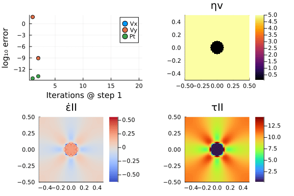
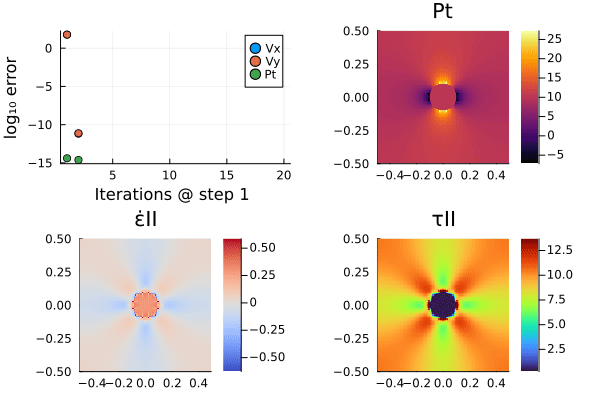
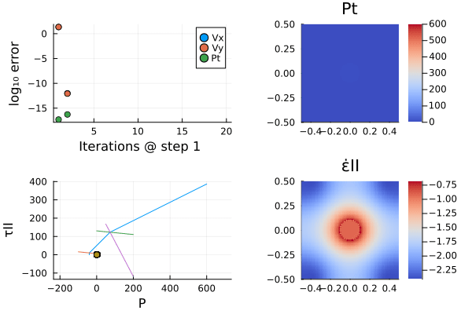
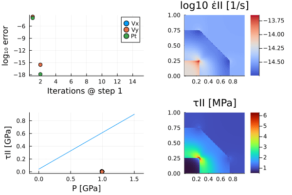
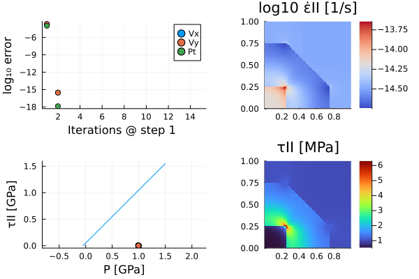
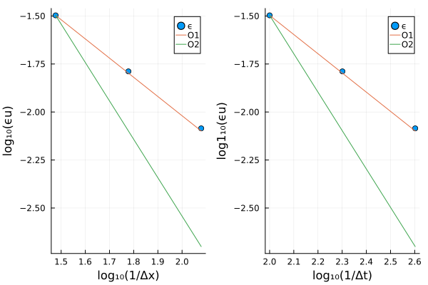
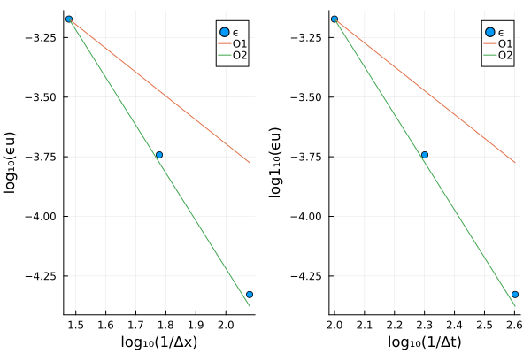

# StagFDTools

This package aims at generating flexible FD stencils that can interoperate with AD tools for Jacobian generation. In particular, the aims are:
- generic treatment of BCs
- generation of equation numbering
- generation of sparsity patterns
- flexible treatment of multi-physics

# Poisson sparsity examples

##  Flag boundary nodes and constant nodes (e.g. inner BC or free surface)
```julia
[ Info: Node types
6×5 Matrix{Symbol}:
 :Neumannn    :Neumannn    :Neumannn    :Neumannn    :Neumannn
 :periodic   :in         :in         :in         :periodic
 :periodic   :in         :in         :in         :periodic
 :periodic   :in         :in         :in         :periodic
 :periodic   :in         :in         :in         :periodic
 :Dirichlet  :Dirichlet  :Dirichlet  :Dirichlet  :Dirichlet
```

## Generation of a 5-point stencil including a symmetry test
```julia 
[ Info: 5-point stencil
12×12 ExtendableSparseMatrixCSC{Float64, Int64} with 54 stored entries:
 1.0  1.0  1.0  1.0   ⋅    ⋅    ⋅    ⋅    ⋅    ⋅    ⋅    ⋅ 
 1.0  1.0  1.0   ⋅   1.0   ⋅    ⋅    ⋅    ⋅    ⋅    ⋅    ⋅ 
 1.0  1.0  1.0   ⋅    ⋅   1.0   ⋅    ⋅    ⋅    ⋅    ⋅    ⋅ 
 1.0   ⋅    ⋅   1.0  1.0  1.0  1.0   ⋅    ⋅    ⋅    ⋅    ⋅ 
  ⋅   1.0   ⋅   1.0  1.0  1.0   ⋅   1.0   ⋅    ⋅    ⋅    ⋅ 
  ⋅    ⋅   1.0  1.0  1.0  1.0   ⋅    ⋅   1.0   ⋅    ⋅    ⋅ 
  ⋅    ⋅    ⋅   1.0   ⋅    ⋅   1.0  1.0  1.0  1.0   ⋅    ⋅ 
  ⋅    ⋅    ⋅    ⋅   1.0   ⋅   1.0  1.0  1.0   ⋅   1.0   ⋅ 
  ⋅    ⋅    ⋅    ⋅    ⋅   1.0  1.0  1.0  1.0   ⋅    ⋅   1.0
  ⋅    ⋅    ⋅    ⋅    ⋅    ⋅   1.0   ⋅    ⋅   1.0  1.0  1.0
  ⋅    ⋅    ⋅    ⋅    ⋅    ⋅    ⋅   1.0   ⋅   1.0  1.0  1.0
  ⋅    ⋅    ⋅    ⋅    ⋅    ⋅    ⋅    ⋅   1.0  1.0  1.0  1.0
12×12 SparseArrays.SparseMatrixCSC{Float64, Int64} with 0 stored entries:
  ⋅    ⋅    ⋅    ⋅    ⋅    ⋅    ⋅    ⋅    ⋅    ⋅    ⋅    ⋅ 
  ⋅    ⋅    ⋅    ⋅    ⋅    ⋅    ⋅    ⋅    ⋅    ⋅    ⋅    ⋅ 
  ⋅    ⋅    ⋅    ⋅    ⋅    ⋅    ⋅    ⋅    ⋅    ⋅    ⋅    ⋅ 
  ⋅    ⋅    ⋅    ⋅    ⋅    ⋅    ⋅    ⋅    ⋅    ⋅    ⋅    ⋅ 
  ⋅    ⋅    ⋅    ⋅    ⋅    ⋅    ⋅    ⋅    ⋅    ⋅    ⋅    ⋅ 
  ⋅    ⋅    ⋅    ⋅    ⋅    ⋅    ⋅    ⋅    ⋅    ⋅    ⋅    ⋅ 
  ⋅    ⋅    ⋅    ⋅    ⋅    ⋅    ⋅    ⋅    ⋅    ⋅    ⋅    ⋅ 
  ⋅    ⋅    ⋅    ⋅    ⋅    ⋅    ⋅    ⋅    ⋅    ⋅    ⋅    ⋅ 
  ⋅    ⋅    ⋅    ⋅    ⋅    ⋅    ⋅    ⋅    ⋅    ⋅    ⋅    ⋅ 
  ⋅    ⋅    ⋅    ⋅    ⋅    ⋅    ⋅    ⋅    ⋅    ⋅    ⋅    ⋅ 
  ⋅    ⋅    ⋅    ⋅    ⋅    ⋅    ⋅    ⋅    ⋅    ⋅    ⋅    ⋅ 
  ⋅    ⋅    ⋅    ⋅    ⋅    ⋅    ⋅    ⋅    ⋅    ⋅    ⋅    ⋅ 
```

## Generation of a 9-point stencil including a symmetry test
```julia
[ Info: 9-point stencil
12×12 ExtendableSparseMatrixCSC{Float64, Int64} with 54 stored entries:
 1.0  1.0  1.0  1.0   ⋅    ⋅    ⋅    ⋅    ⋅    ⋅    ⋅    ⋅ 
 1.0  1.0  1.0   ⋅   1.0   ⋅    ⋅    ⋅    ⋅    ⋅    ⋅    ⋅ 
 1.0  1.0  1.0   ⋅    ⋅   1.0   ⋅    ⋅    ⋅    ⋅    ⋅    ⋅ 
 1.0   ⋅    ⋅   1.0  1.0  1.0  1.0   ⋅    ⋅    ⋅    ⋅    ⋅ 
  ⋅   1.0   ⋅   1.0  1.0  1.0   ⋅   1.0   ⋅    ⋅    ⋅    ⋅ 
  ⋅    ⋅   1.0  1.0  1.0  1.0   ⋅    ⋅   1.0   ⋅    ⋅    ⋅ 
  ⋅    ⋅    ⋅   1.0   ⋅    ⋅   1.0  1.0  1.0  1.0   ⋅    ⋅ 
  ⋅    ⋅    ⋅    ⋅   1.0   ⋅   1.0  1.0  1.0   ⋅   1.0   ⋅ 
  ⋅    ⋅    ⋅    ⋅    ⋅   1.0  1.0  1.0  1.0   ⋅    ⋅   1.0
  ⋅    ⋅    ⋅    ⋅    ⋅    ⋅   1.0   ⋅    ⋅   1.0  1.0  1.0
  ⋅    ⋅    ⋅    ⋅    ⋅    ⋅    ⋅   1.0   ⋅   1.0  1.0  1.0
  ⋅    ⋅    ⋅    ⋅    ⋅    ⋅    ⋅    ⋅   1.0  1.0  1.0  1.0
12×12 SparseArrays.SparseMatrixCSC{Float64, Int64} with 0 stored entries:
  ⋅    ⋅    ⋅    ⋅    ⋅    ⋅    ⋅    ⋅    ⋅    ⋅    ⋅    ⋅ 
  ⋅    ⋅    ⋅    ⋅    ⋅    ⋅    ⋅    ⋅    ⋅    ⋅    ⋅    ⋅ 
  ⋅    ⋅    ⋅    ⋅    ⋅    ⋅    ⋅    ⋅    ⋅    ⋅    ⋅    ⋅ 
  ⋅    ⋅    ⋅    ⋅    ⋅    ⋅    ⋅    ⋅    ⋅    ⋅    ⋅    ⋅ 
  ⋅    ⋅    ⋅    ⋅    ⋅    ⋅    ⋅    ⋅    ⋅    ⋅    ⋅    ⋅ 
  ⋅    ⋅    ⋅    ⋅    ⋅    ⋅    ⋅    ⋅    ⋅    ⋅    ⋅    ⋅ 
  ⋅    ⋅    ⋅    ⋅    ⋅    ⋅    ⋅    ⋅    ⋅    ⋅    ⋅    ⋅ 
  ⋅    ⋅    ⋅    ⋅    ⋅    ⋅    ⋅    ⋅    ⋅    ⋅    ⋅    ⋅ 
  ⋅    ⋅    ⋅    ⋅    ⋅    ⋅    ⋅    ⋅    ⋅    ⋅    ⋅    ⋅ 
  ⋅    ⋅    ⋅    ⋅    ⋅    ⋅    ⋅    ⋅    ⋅    ⋅    ⋅    ⋅ 
  ⋅    ⋅    ⋅    ⋅    ⋅    ⋅    ⋅    ⋅    ⋅    ⋅    ⋅    ⋅ 
  ⋅    ⋅    ⋅    ⋅    ⋅    ⋅    ⋅    ⋅    ⋅    ⋅    ⋅    ⋅ 
```
## Power-law Stokes (standard staggered grid - asymmetric operator)


<!-- 
 -->

## Shear banding with compressibility and dilatancy


## Pressurized holed with mixed-mode plasticity (see Kiss et al., 2023)


## Host-inclusion decompression with Drucker-Prager plasticity


## Host-inclusion decompression with tensile plasticity


## Power-law Stokes (full staggered grid - symmetric operator)


## Anisotropic Stokes (full staggered grid - symmetric operator)


## Diffusion (backward Euler)


## Diffusion (Crank-Nicolson)


# Two-phase flow


